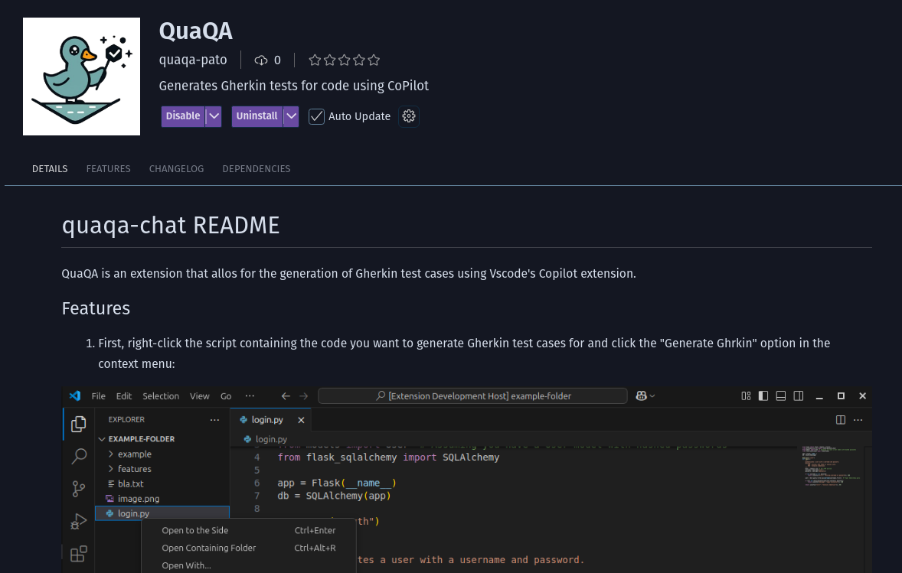

# QuaQA

[]()
[](https://github.com/silvercent011/QuaQA/issues)
[](https://github.com/silvercent011/QuaQA/pulls)
[](/LICENSE)

## Descrição

O QuaQA permite a geração automática de casos de teste em Gherkin a partir de scripts no VSCode. Com uma integração direta ao menu de contexto, os testes gerados são armazenados na pasta ./features/ do workspace, facilitando a organização e automação do processo de testes.


## Início Rápido

Instale a extensão via [VSCode Marketplace](https://marketplace.visualstudio.com/items?itemName=quaqa-pato.quaqa-chat):


ou instale manualmente seguindo os passos abaixo:

1. Clonar o projeto

```
git clone git@github.com:aas8/QuaQA-Chat.git

```
2. Instalar dependencias

```bash
npm install
```

3. Preparar pacote de extensão

```
find . -name '*.vsix' -delete && vsce package
```

O comando acima criará um arquivo .vsix na pasta raiz do projeto. Use ele para instalar a extensão no VSCode.

4. Instalar no vscode

```
code --install-extension ./nome_do_arquivo.vsix
```

5. Selecione um script no vscode
6. Clique com o botão direito do mouse
7. Generate Gherkin


### Instalação

```bash
clone o repositório
git clone https://github.com/aas8/QuaQA-Chat.git
```

```bash
instale todas as dependências
npm install
```

```bash
crie um arquivo .vsix
make pre-publish
```

### Para publicar a extensão no vscode:

```
vsce publish

ou

make publish
```

## Uso


Como usar:

<video src="./media/usage_example.mp4" />


## Funcionalidades

- Analisar arquivo/script
- Gerar descrição detestes usando Gherkin


## Licença

Este projeto está licenciado sob a Licença MIT - veja o arquivo [LICENSE.md](./LICENSE.md) para detalhes.

## Créditos

- Adriana Alves dos Santos (@aas8)
- Daniel Carvalho (@ddevdan)
- Sidney Alex de Amorim Arruda (@silvercent011)

## FAQ

**Pergunta 1:** Como faço para configurar o ambiente?

**Resposta:**
Os requisitos para rodar o projeto são:
- Node.js
- npm
- VSCode editor


## Screenshots



---
